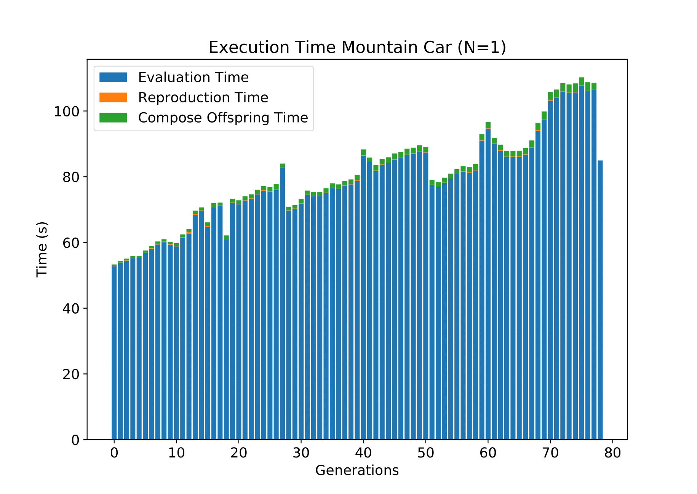
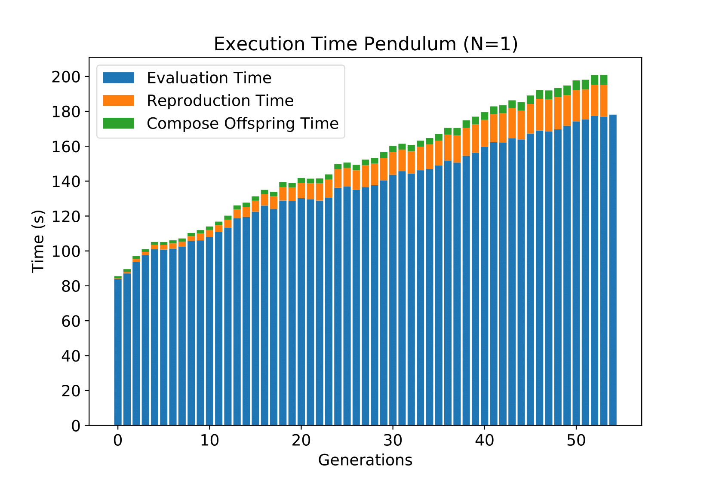
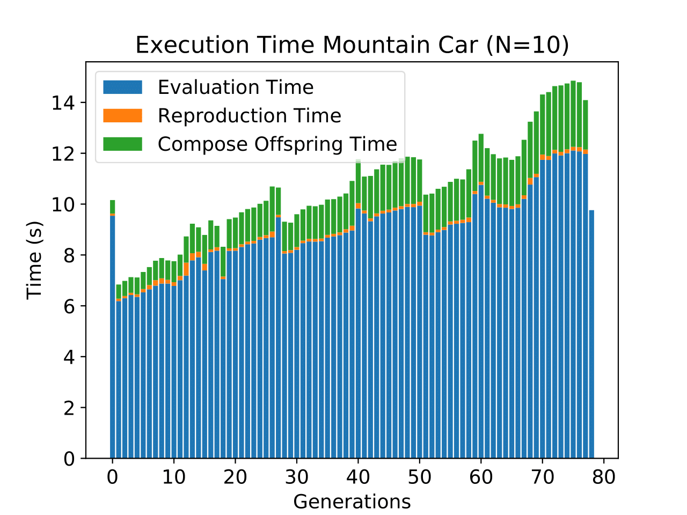
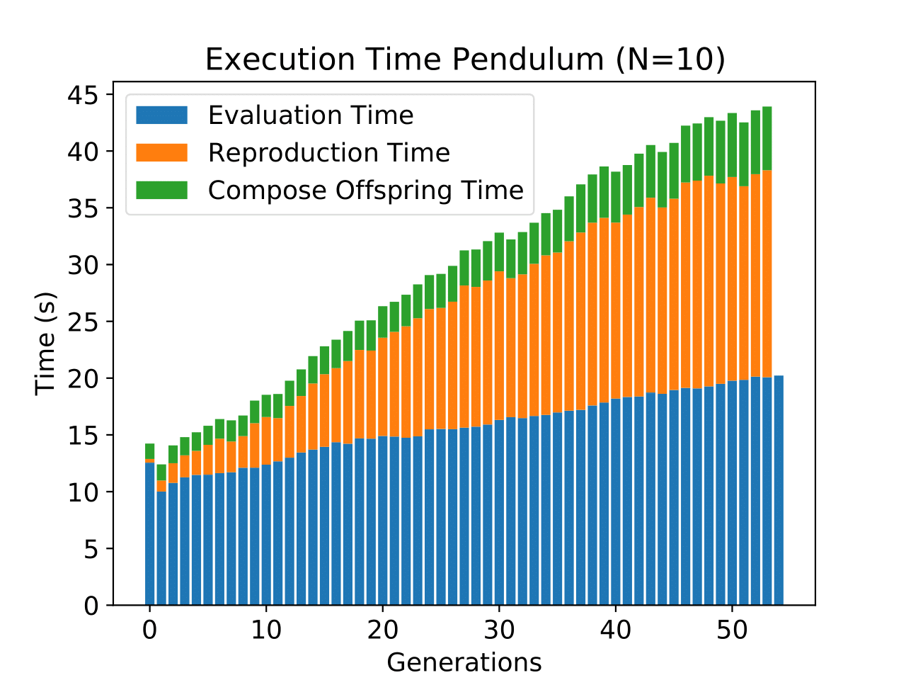
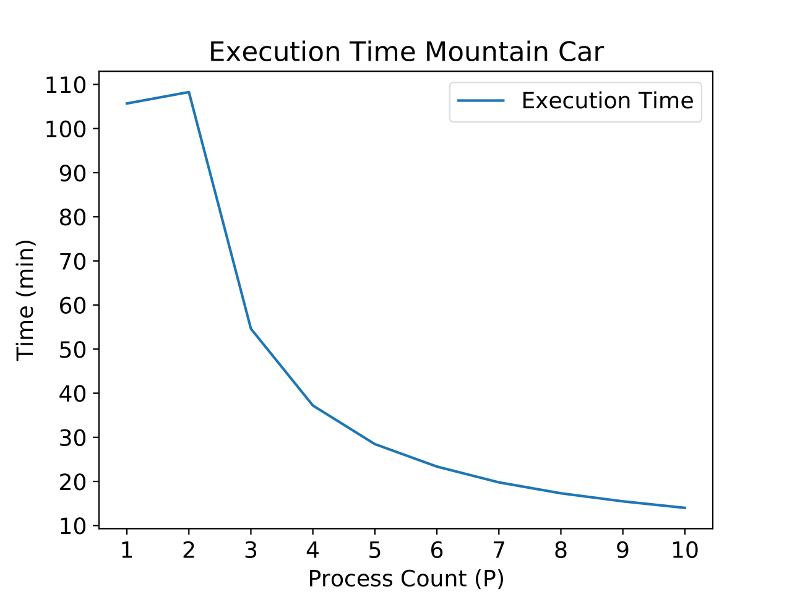
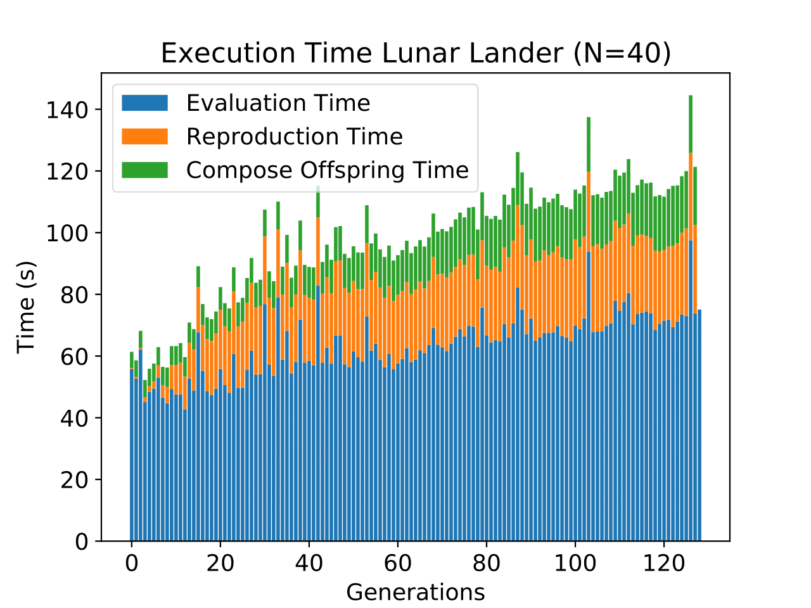
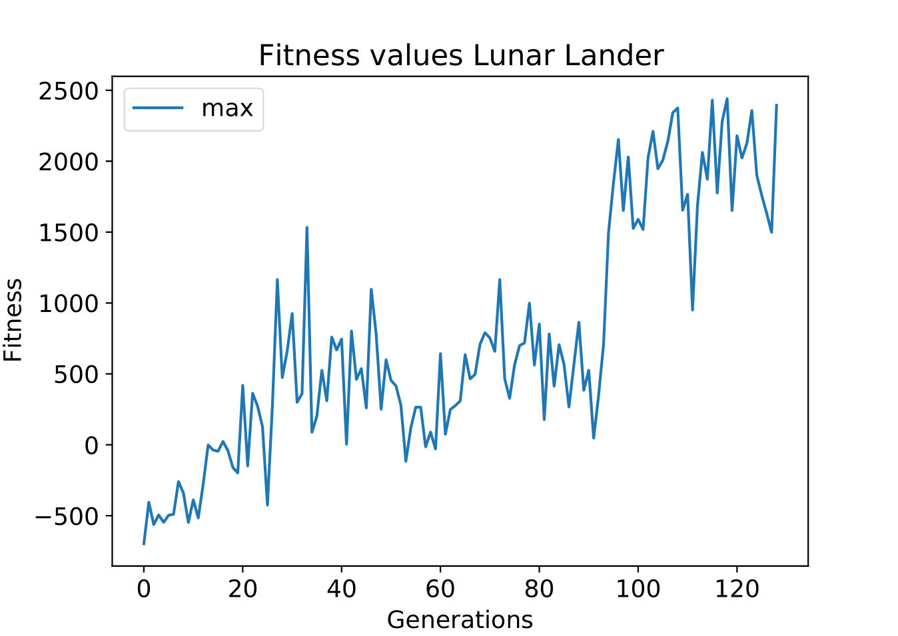
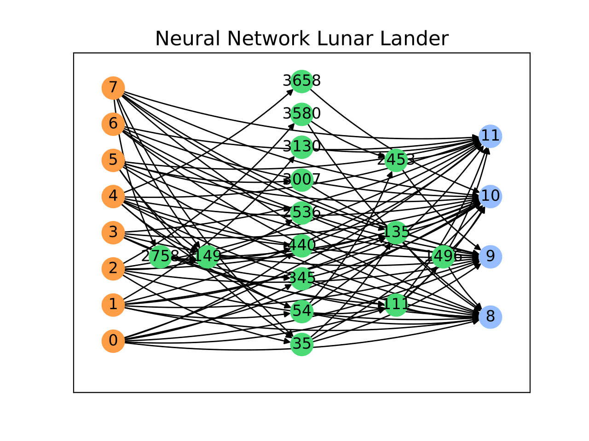

# MPI_NEAT

 
[](https://codecov.io/gh/simonhauck/MPI_NEAT)

This repository was created as part of my master thesis. The goal was to implement and analyze the [NEAT](http://nn.cs.utexas.edu/downloads/papers/stanley.ec02.pdf) algorithm and
parallelize the execution with MPI on a Beowulf cluster. This repository contains the program code as well as the actual thesis and images.
If you are interested in this project this README gives an overview over the results and how to run the code. For a setup guide
follow the instructions in the INSTALL.md file.

## How to run this project
In my thesis I used a cluster of 10 Raspberry Pi 4s to execute the program code. But it is also possible to use a single 
machine with multiple cores. This implementation with MPI has in contrast to the standard python interpreter the advantage, 
that the complete CPU can be utilized. 

### Unit Tests
Before you execute the project you can check with the unit test that everything works as intended. To run all tests run the 
following command in the project directory after activating the virtual environment:
```shell script
# Run unit tests
pytest
```
To measure the code coverage run the following command. Note that only the NEAT functions are tested and not the MPI 
implementation (This is the reason for the low code coverage). Unit testing MPI code is much more difficult and 
therefore not part of this project.
```shell script
# Run unit test with code coverage
pytest --cov-config=code/src/.coveragerc --cov=code/src/
```
If you want to test your setup and check if everything regarding MPI works as intended, feel free to use my hello world script.
Every node prints a hello world string with its rank and the device name. You can execute the program with the following
command.
```shell script
mpiexec -n 4 python -m mpi4py code/src/mpi_tutorial/mpi_hello_world.py
```
The parameter "-n" indicates the amount of processes to be used. In this example four processes are used and they are all
started on the same machine. To utilize the complete cluster a machinefile or hostfile is required, where the ip addresses
of all nodes are specified. This project contains already a machine file which must be modified. To execute the the 
hello world program on the complete cluster use the following command
```shell script
mpiexec --machinefile code/machinefile.txt -n 40 $HOME/venv/neat_mpi_env/bin/python3 -m mpi4py code/src/mpi_tutorial/mpi_hello_world.py
```
The parameter "--machinefile" contains the path to the machinefile. In addition is the path to the python interpreter given.
This is required, because the virtual environment can't be activated on the nodes. As you can see, in this case are forty
processes used.

### Start a Training process
The project contains two scripts which are used to start the training/optimization process and to visualize the results.
First the script to train a model is introduced. This project contains a few examples, which are in the
examples folder. Generally, all examples can be trained with a sequential or a parallel algorithm. With the same seed, 
both implementations produce the same results. To start a training process with the sequential algorithm use the following
command with the activated virtual environment.
```shell script
python code/src/main.py xor -s 1
```
The parameter "-s" indicates the seed for the environment. With the same seed, the same results are generated. To run
the same example with the MPI implementation, use the following command. Note that the current directory must be the 
"src" folder. The parameter "-o" specifies in this case  that the MPI implementation should be used.
The remaining components with the machinefile are identically to the other examples 
```shell script
mpiexec --machinefile ../machinefile.txt -n 40 $HOME/venv/neat_mpi_env/bin/python3 -m mpi4py.futures main.py xor -s 1 -o mpi
```
The xor optimization problem is very simple and can be trained in a few seconds. Some more complex alternatives are the 
mountain car, pendulum, pole balancing and lunar lander challenge of the OpenAI Gym. To start these environments use the following commands.
```shell script
# Mountain Car
mpiexec --machinefile ../machinefile.txt -n 1 $HOME/venv/neat_mpi_env/bin/python3 -m mpi4py.futures main.py mountain_car -s 1413 -o mpi

# Pendulum
mpiexec --machinefile ../machinefile.txt -n 1 $HOME/venv/neat_mpi_env/bin/python3 -m mpi4py.futures main.py pendulum -s 1 -o mpi

# Lunar Lander
mpiexec --machinefile ../machinefile.txt -n 40 $HOME/venv/neat_mpi_env/bin/python3 -m mpi4py.futures main.py lunar_lander -s 1 -o mpi

# Pole balancing
mpiexec --machinefile ../machinefile.txt -n 40 $HOME/venv/neat_mpi_env/bin/python3 -m mpi4py.futures main.py pole_balancing -s 1 -o mpi
```
All examples train a model and save it as file in the /tmp directory. The file contains the measured executions time as 
well as the fitness values and the final genome. These can be loaded and visualized in the next section.

## Visualize the results
The stored .data files can be visualized with a second script. This does not involve MPI and can be done with a normal 
python command. Some stored example results are in the trained models folder and can be loaded and visualized. To do this
use the following commands.
```shell script
# Mountain Car
python visualize.py mountain_car ../trained_models/mountain_car/1413_40cores_10pi/mountain_car_finish78.data

# Lunar Lander
python visualize.py lunar_lander ../trained_models/lunar_lander/general_10run_40cores_10devices/lunar_landerfinish128.data

# Pendulum
python visualize.py pendulum ../trained_models/pendulum/pendulum_1_40core_10pi/pendulumfinish54.data
```
The visualize script does not only show the environment, it shows also the required time, fitness values and the amount
of species. For the mountain car and pendulum environment there are multiple runs with different amount of processes.
The result of these runs is the same, but the execution time varies widely and is the base for the analysis and optimization
of the algorithm. More on this later :)

For training a new environment you can take the xor problem as a base example and create your own custom problem. With 
the given interfaces it is very simple to create a new optimization problem customized to your specific needs.

## Performance Analysis and Results
As part of my thesis I created a sequential implementation of NEAT and analyzed the required time to optimize the examples.
The pole balancing and xor problem were to easy for NEAT and are therefore not used. Instead the performance analyses was 
performed with the mountain car and pendulum environment. I divided the execution in three categories,
the Evaluation Time, Reproduction Time and ComposeOffSpring Time. The EvaluationTime is the time to evaluate a genome in 
the optimization problem. The ComposeOffSpring Time measures the required time for the reproduction and mutation of the genomes.
The Reproduction Time measures the remaining components of NEAT, like sorting the genomes into species or selecting the parent genomes.
The measured times with the sequential algorithm are displayed in the following graphs.
<p align="center">
    
    
</p>

It is obvious that the EvaluationTime is in both examples the biggest factor regarding the execution time. So this part will
be parallelized mit MPI. I choose a Master-Slave architecture for the communication. So with 10 Raspberry Pis I have one master,
which coordinates the communication and 9 slaves which perform the evaluation of the genomes in the optimization problem.
After implementing the MPI algorithm the same tests are performed with the same seed. The sequential as well as the parallel 
algorithm create exact the same solution and therefore the execution time can be compared easily. The measured execution
time with 10 processes, one on each Raspberry Pi is shown in the following diagram.
<p align="center">
    
    
</p>
Compared to the first diagram is the execution time now significantly lower/faster. Instead of 105 minutes the MPI 
implementation requires now only 14 Minutes to optimize the mountain car environment. This equals a SpeedUp from 7.6 for 
the execution time. If only the parallelized Evaluation Time is considered, the SpeedUp equals 8.7. Considering the 9 
slaves this is an efficiency of round about 97%. This is a very good result and shows the success of the implementation. 
With three to nine cores the nearly the same efficiency are reached in every run. The efficiency values for the pendulum
environment are nearly the same.

It is also obvious, that the Reproduction and Compose Offspring Time have with more cores a much larger impact on the 
execution time. The reason is, that these operations still run sequential and the execution time is therefore the same. 
With more processes, the Reproduction and ComposeOffSpring time become more and more a limiting factor. This is visible
if the total execution time is visualized depending on the number of processes like in the next Graph.
<p align="center">
    
</p>
With two processes, the cluster is slower than the sequential algorithm because of the communication overhead. With more
processes the execution time is reduced, but with more processes the gain will decrease. To achieve better even better results
the Reproduction and Compose OffSpring Time must be parallelized too. More in this in the future improvements.

Each Raspberry Pi 4 contains four cores. So it is possible, to run the same challenges with a total of forty processes.
Unfortunately, the results obtained here do not correspond to the previous ones. It is still faster, but the SpeedUp for the
EvaluationTime is only 26.7. Different test indicate, that multiple processes on the same machine hinder each other and
that some sort of race conditions occur. This occurs among other things by using the OpenAI Gym regardless of the number 
of messages. Keep this in mind if you run multiple processes on the same machine.

## Lunar Lander
Finally, the LunarLander example should clarify the importance of parallelization. In this challenge from the OpenAI Gym
an agent must land a spaceship. This environment is more complex then the others before and requires a larger neural
network and accordingly a longer optimization time. With forty processes this took round about 3.5 hours. With the 
previously obtained efficiency values, it can be assumed that the execution time with the sequential algorithm would be
between 62.1 and 68.7 hours. This is a huge speedup ;) The next graph shows the measured execution times for each generation.
<p align="center">
    
</p>
In addition it is possible to visualize the genome/neural network and the fitness values. This is also possible with the
other examples. To see these images either checkout the project yourself or take a look at my thesis, where everything is
described much more detailed. 
<p align="center">
    
    
</p>

## Future improvements
If you think "Hey this is a cool project and i want to continue working on this" then here are some ideas.
As seen above, the sequential Reproduction and Compose Offspring Time are the limiting factor with more processes. 
One of the next steps would be to parallelize these. With the given Master-Slave Architecture it is easy to extend
the current implementation with new functions. One difficulty with this parallelization is that a part of the code has to be 
processed sequentially. This limits the maximum achievable SpeedUp. Nonetheless for a good overall SpeedUp with many cores
this can be very useful. Another step would be to investigate why the bottleneck occurs, if multiple processes are on the same
machine (despite having multiple cores). A last optimization would be to integrate frameworks like Tensorflow or PyTorch.
Currently a custom neural network implementation is used, which is of course less efficient than these library. With the
provided neural network interface it should be relatively easy to integrate these.  
